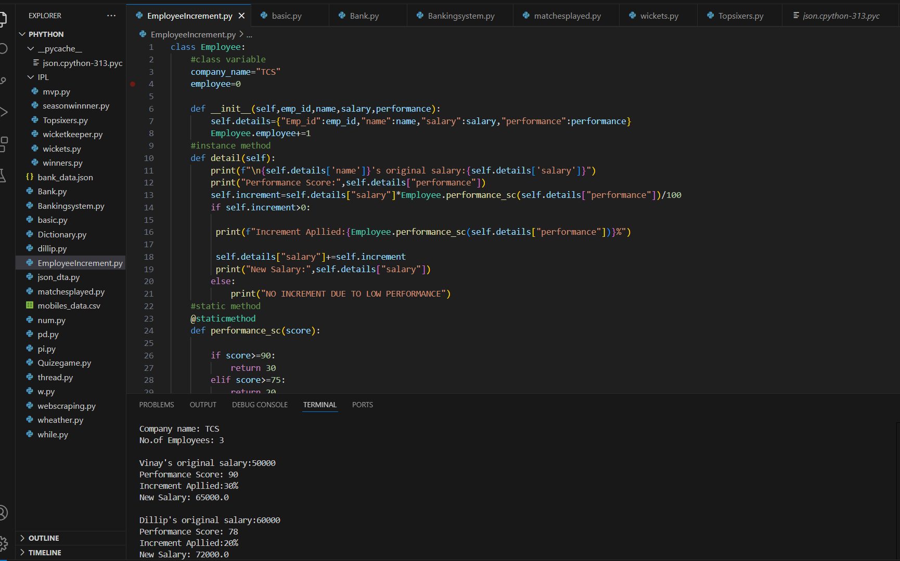

# Performance-Based Increment

This Python project calculates employee salary increments based on their performance percentage using conditional logic.

## Features
- Takes employee name, salary, and performance percentage.
- Applies increment rules based on performance.
- Outputs the new salary and increment amount.

## Screenshots

### Code



## Files
- EmployeeIncrement.py: Main source code.
- EmployeeIncrement1.png, EmployeeIncrement2.png: Screenshots showing the output.

## How to Run
1. Download the Python file.
2. Run it using Python 3:
   ```bash
   python EmployeeIncrement.py
